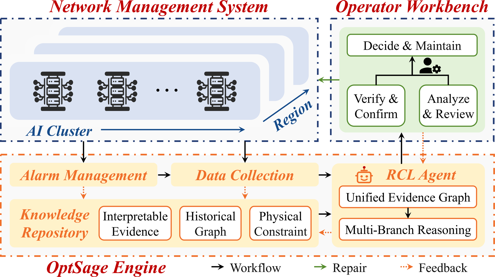
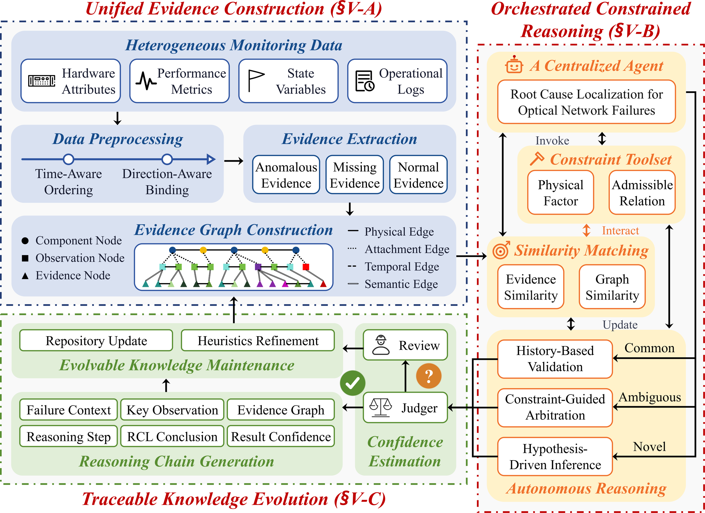
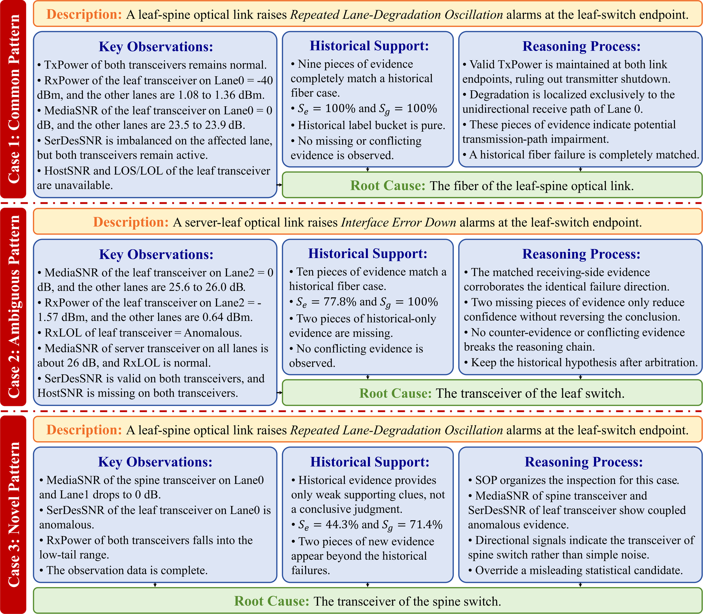
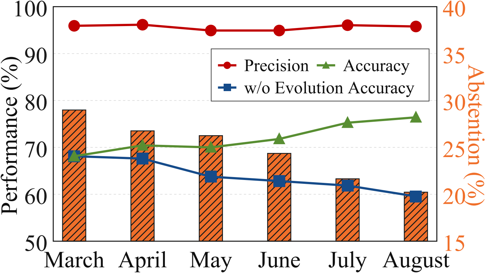
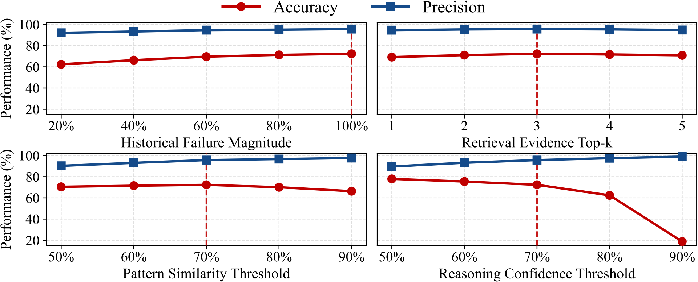

# OptSage: Localizing Optical Network Failures in AI Clusters with Agentic Explainable Reasoning

This repository contains the review artifact for OptSage, an agentic system
for root-cause localization in optical networks. The implementation follows the
submitted manuscript and is prepared for double-blind review: it contains no
author list, affiliation, personal contact, production telemetry, credentials,
or identifying repository links.

## Introduction

Optical-link symptoms are often aliased: insufficient received power can be
caused by the local receiver, the remote transmitter, or the transmission
medium. Monitoring data also varies by hardware, topology, lane width, and
collection availability. OptSage addresses these conditions through three
connected mechanisms:

1. **Unified evidence construction** transforms hardware attributes,
   performance metrics, state variables, and operational logs into a
   time-aware and direction-aware evidence graph.
2. **Orchestrated constrained reasoning** combines historical graph retrieval,
   physical constraints, and a centralized agent with separate strategies for
   common, ambiguous, and novel failure patterns.
3. **Traceable knowledge evolution** produces an auditable reasoning chain,
   abstains when confidence is insufficient, and incorporates only
   operator-confirmed failures into versioned knowledge.

<p align="center">
  
</p>

<p align="center"><em>System workflow from monitoring and evidence collection to operator verification and knowledge feedback.</em></p>

The manuscript reports a six-month production assessment with 72.3% overall
accuracy, 95.6% precision among definitive outputs, and a reduction in mean
repair time from 48.5 minutes to 6.5 minutes. Those production measurements are
reported for context only; private operational data is not distributed here.

## Method

<p align="center">
  
</p>

<p align="center"><em>Unified evidence construction, orchestrated constrained reasoning, and traceable knowledge evolution.</em></p>

### Unified evidence graph

Telemetry is stably ordered by observation time. Equal-index optical lanes are
bound by transmission direction when topology compatibility is established.
The graph contains:

- component, observation, evidence, and hypothesis nodes;
- physical, attachment, temporal, semantic, and directional edges;
- anomalous, normal, and explicitly unavailable evidence;
- support, contradiction, and unavailability relations for root-cause
  hypotheses.

Online input is label-free by construction. `label`, `root_cause`, and
`confirmed_root_cause` are rejected at the evidence-construction boundary.

### Similarity identification

The evidence similarity in Eq. (1) is an IDF-weighted Jaccard score:

```text
S_e(o, i) = sum(IDF(x), x in F_o intersect F_i)
            / sum(IDF(x), x in F_o union F_i)
```

The graph view applies the same score to semantic graph edges. Retrieval first
selects histories compatible with network layer and lane configuration, then
returns at most three cases. Routing follows the manuscript exactly:

- `S_e = S_g = 1.0` with a pure historical label bucket: common pattern;
- `S_e >= 0.70` and `S_g >= 0.70`: ambiguous pattern;
- otherwise: novel pattern.

A mixed-label complete match is sent to arbitration rather than reused as a
trusted conclusion.

### Constrained reasoning

One centralized agent retains the full incident context and coordinates the
following paths:

- **Common:** reuse an operator-verified historical evidence chain and validate
  it independently against current observations.
- **Ambiguous:** compare graph differences, arbitrate candidate hypotheses under
  physical constraints, and request a missing observation only when it can
  change a supporting or excluding relation.
- **Novel:** enumerate both endpoints and the fiber hypothesis, apply
  deterministic exclusions, inspect same-lane directional evidence, and follow
  a versioned inspection procedure.

Every model-generated reasoning step must cite available evidence and an
applicable physical constraint. Invalid steps receive bounded revision feedback;
unresolved violations fail closed.

<p align="center">
  
</p>

<p align="center"><em>Representative reasoning chains for common, ambiguous, and novel failure patterns.</em></p>

### Confidence and reasoning chain

The primary reasoner and the lightweight confidence judger are separate
interfaces. Following Eq. (2), confidence is the geometric mean of evidence
completeness, constraint compliance, and reasoning validity. Results below the
default threshold of 0.70 request evidence or operator review instead of forcing
a root-cause class.

Each result contains the five fields defined in the manuscript:

- failure context;
- key observations;
- reasoning steps;
- root-cause localization conclusion;
- result reliability and limiting factors.

## Reported evaluation context

The figures below summarize the production evolution and the sensitivity study
reported in the manuscript. They document the paper's evaluation and are not
recomputed from the synthetic fixture distributed in this repository.

<p align="center">
  
</p>

<p align="center"><em>Production precision, accuracy, abstention, and the effect of knowledge evolution.</em></p>

<p align="center">
  
</p>

<p align="center"><em>Sensitivity to historical knowledge size, retrieval Top-k, similarity threshold, and confidence threshold.</em></p>

## Installation

Python 3.10 or newer is required. The core artifact uses only the Python
standard library.

```bash
git clone <anonymous-repository-url>
cd <repository-directory>
python3 -m pip install -e .
```

## Data

Only one sanitized synthetic fixture is distributed:

```text
data/sample.json
```

It contains three operator-confirmed historical graphs and three label-free
queries that exercise the three routing conditions. It is intended for schema,
execution, and regression validation. It contains no production telemetry and
must not be used to recompute the manuscript's reported results.

The top-level structure is:

```json
{
  "schema_version": "optsage-sample-v1",
  "history": [],
  "queries": []
}
```

Historical entries require `confirmed_root_cause` and confirmation provenance.
Online query entries must not contain any label field.

## Inference

Process all included queries:

```bash
python3 run_inference.py
```

Process one case or save structured output:

```bash
python3 run_inference.py --case query-common-001
python3 run_inference.py --output result.json
```

Library usage:

```python
from optsage import KnowledgeRepository, OptSage

repository = KnowledgeRepository.from_cases(confirmed_history)
system = OptSage(repository, top_k=3, tau=0.70, epsilon=0.70)
result = system.diagnose(label_free_case)
```

The offline inference path is deterministic and requires no external service or
credential. Optional primary-reasoner and independent-judger adapters implement
the manuscript's structured model contracts.

## Repository structure

The implementation is divided along the system boundaries used in the paper:

```text
optsage/
  models.py       immutable graph, case, candidate, and version schemas
  evidence.py     telemetry normalization and unified evidence construction
  constraints.py  admissible relations and deterministic physical checks
  repository.py   dual-view retrieval and versioned knowledge evolution
  reasoning.py    routing, constrained inference, judging, and abstention
  api.py          end-to-end application facade and sample loader
  system.py       backward-compatible import surface
run_inference.py  command-line inference entry point
tests/            mechanism and module-boundary regression checks
```

This separation keeps physical knowledge distinct from statistical retrieval,
keeps label-free evidence construction independent of historical labels, and
makes each paper mechanism independently inspectable.

## Knowledge evolution

`KnowledgeRepository.evolve` accepts only independently confirmed failures and
returns a new content-addressed repository version. Periodic consolidation
merges duplicate patterns while preserving mixed-label conflicts for review.
Monthly heuristic revisions remain validation-pending until explicitly
validated. Superseded knowledge is retained for traceability and rollback but
excluded from retrieval.

No inference output is automatically written back into knowledge.

## Validation

```bash
python3 -m unittest discover -s tests -v
```

The focused suite checks label isolation, graph construction, the two
similarity views, exact routing boundaries, topology compatibility, constraint
applicability, bounded reasoning revision, independent confidence judging,
abstention, reasoning-chain structure, and versioned knowledge maintenance.

The section-by-section implementation mapping is available in
[`docs/PAPER_IMPLEMENTATION.md`](docs/PAPER_IMPLEMENTATION.md). Validation
evidence is summarized in [`Validation.md`](Validation.md).

## Artifact scope

This branch implements the manuscript's system mechanisms in a modular,
inspectable form. It intentionally excludes private datasets, production
connectors, trained model checkpoints, experiment caches, generated reports,
and deployment-specific configuration.

The available data contract supports equal-index lane binding but does not
establish cross-device calibration for absolute power subtraction. The artifact
therefore represents direction with categorical states such as
`not_emitted`, `emitted_not_received`, and `paired_normal`, rather than
presenting an uncalibrated Tx/Rx difference as absolute transmission loss.
